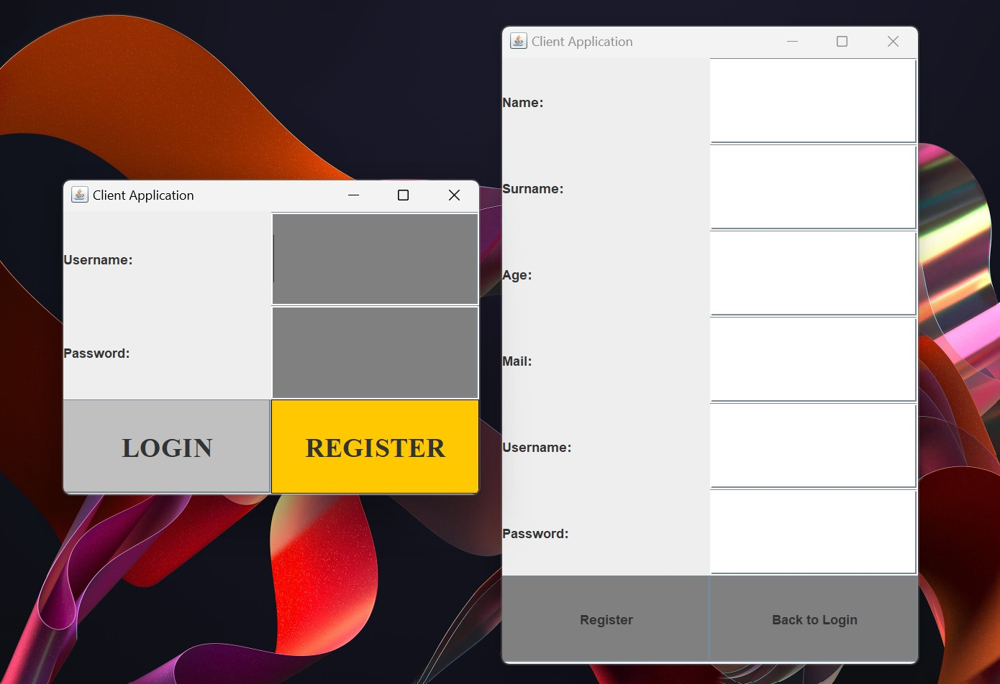
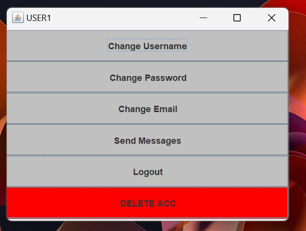
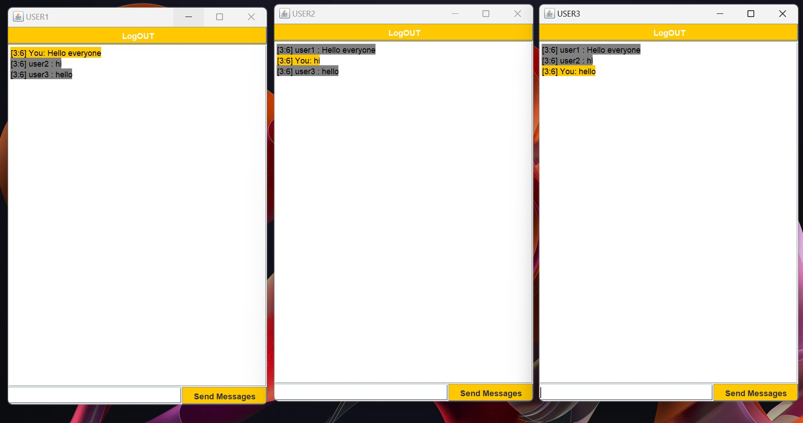

# 💬 Simple Java Chat System

## **Technologies Used**  
`Java 21`

---

## 🚀 Getting Started  
- **Run the Server** first, then launch the `ClientGUI`.
- A simple chat system with login and registration.
- Users can change their **username, password, and email**.
- Send messages to all connected users.
- Delete your account permanently.
- Messages are broadcast to all users connected to the server.
- Enable multiple instances in `ClientGUI`:  
  **Edit Configurations → Modify Options → Allow Multiple Instances**

---

## 🔥 Features  
✔ **Login Confirmation** - Validates username and password.  
✔ **Send Messages** - Chat with all online users.  
✔ **Delete Account** - Remove your account permanently.  

---

## 📸 Screenshots  
  
*User Registration & Login*  

  
*Login Screen*  

  
*Broadcasting Messages to All Users*  

---

## 📥 Installation  
Clone the repository:
```bash
git clone https://github.com/MilenkovskiTrajche/ChatSistem.git
```

---

### 📌 *A simple and efficient chat system built with Java!*

